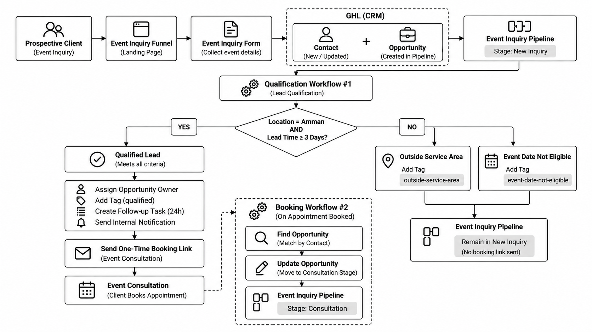
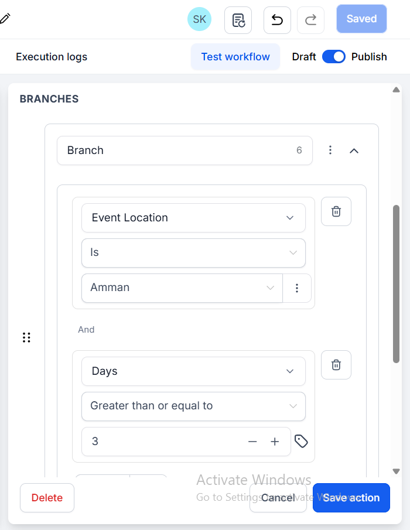
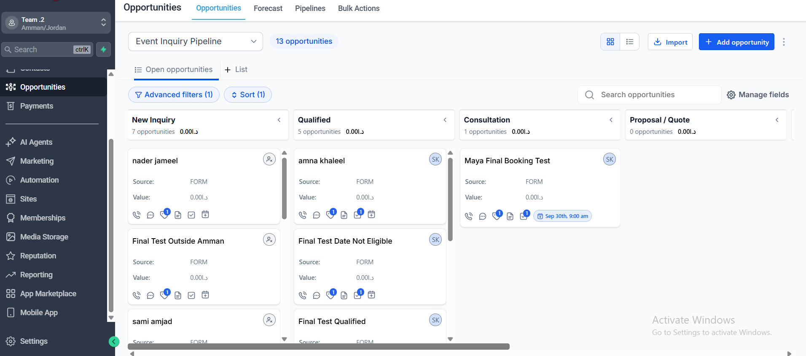
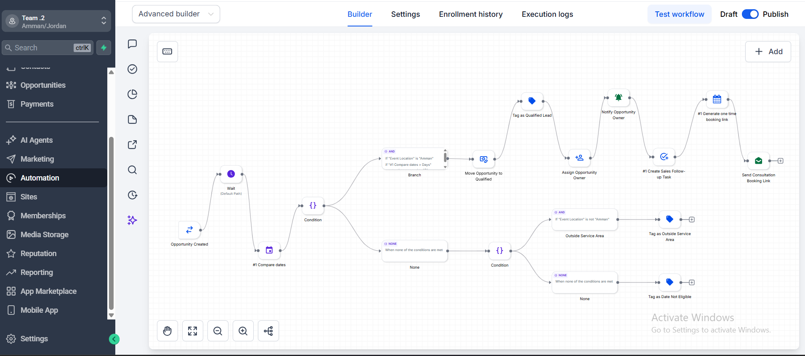
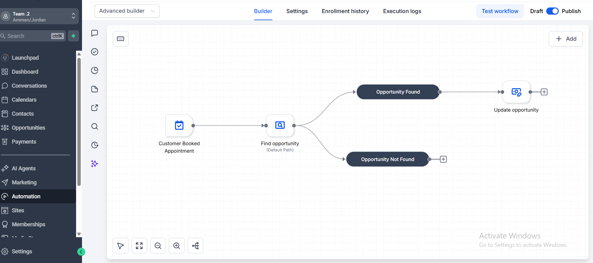
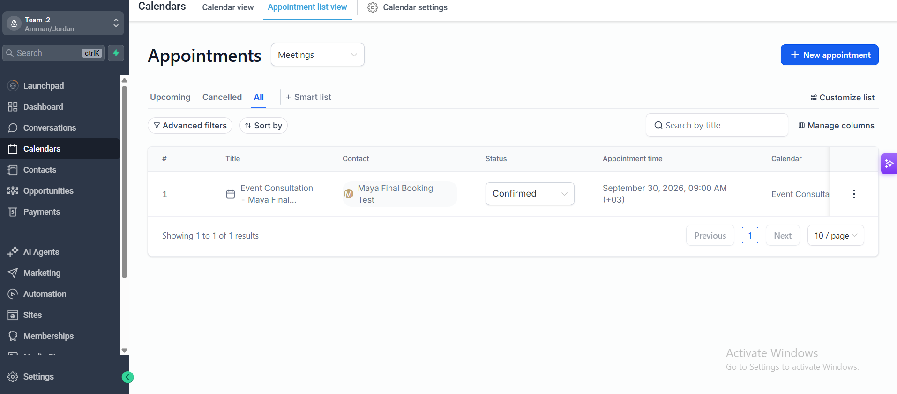
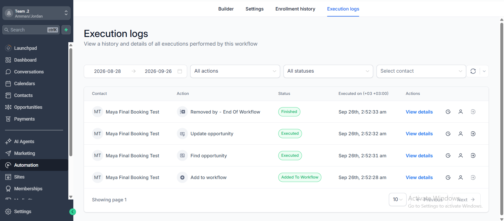

# Event Services Lead Qualification & CRM Automation

GoHighLevel (GHL) CRM automation for capturing event inquiries, applying rule-based lead qualification, coordinating sales follow-up, and moving qualified leads from inquiry to consultation booking.

> **Project Status:** Complete  
> **Qualification Tests:** Passed  
> **End-to-End Booking Test:** Passed

## System Architecture

The diagram below shows the complete implemented journey from inquiry capture through qualification and consultation booking.

## End-to-End Flow

`Event Inquiry → Contact + Opportunity → Qualification → Qualified Lead → One-Time Booking Link → Event Consultation → CRM Consultation Stage`

## Qualification Logic

A lead automatically qualifies when:

`Event Location = Amman` **AND** `Lead Time >= 3 Days`

Qualified leads are moved to **Qualified**, tagged, assigned to an owner, surfaced through an internal notification, given a follow-up task, and sent a one-time Event Consultation booking link. Leads outside the service area or below the minimum lead time remain in **New Inquiry** and receive classification tags.

## CRM Pipeline

`New Inquiry → Qualified → Consultation → Proposal / Quote → Awaiting Deposit → Event Confirmed / In Planning → Event Completed`

Automation handles the journey through **Consultation**. Later sales decisions remain human-controlled.

## Workflow #1 — Lead Qualification

Trigger: `Opportunity Created`

1. Wait for opportunity data to become available.
2. Calculate lead time using the event date.
3. Evaluate location and lead-time rules.
4. Route the opportunity through the appropriate qualification path.
5. Execute CRM and follow-up actions for qualified leads.
6. Generate and send a one-time consultation booking link.

## Workflow #2 — Booking to Consultation

`Customer Booked Appointment → Find Opportunity → Update Opportunity → Consultation`

The existing CRM opportunity is automatically moved to the **Consultation** stage.

## Testing

| Scenario | Result |
| --- | --- |
| Qualified Lead | PASS |
| Outside Service Area | PASS |
| Event Date Not Eligible | PASS |
| Exact 3-Day Boundary | PASS |
| Full End-to-End Booking Flow | PASS |

**Overall: 5/5 planned test scenarios passed.**

The full E2E test verified:

`Inquiry → Qualification → Booking Link → Confirmed Appointment → Workflow Execution → Consultation`

## Key Engineering Decisions

### Opportunity-Level Event Data
Event details are stored as Opportunity Custom Fields rather than permanent Contact fields, allowing the same customer to have multiple event inquiries.

### Deterministic Qualification
Qualification uses explicit business rules instead of AI, providing predictable and explainable behavior.

### Qualified-Only Booking
Only qualified leads receive the automated one-time booking link.

### Human Decision After Consultation
Movement from **Consultation** to **Proposal / Quote** is intentionally left to the sales representative.

## Debugging & Problem Solving

### Opportunity Data Timing
Testing showed that the Opportunity Created trigger could execute before all form-populated opportunity data was available. A controlled **10-second timing buffer** was added before qualification.

### Date Logic
The date check was replaced with an explicit comparison: `Event Date - Current Date >= 3 Days`. The corrected logic was validated with failing and exact-boundary tests.

## Skills Demonstrated

GoHighLevel (GHL) · CRM Architecture · Pipeline & Opportunity Management · Workflow Automation · Forms & Funnels · Custom Fields & Data Modeling · IF/Else Logic · Date/Time Logic · Tags & Smart Lists · Tasks & Internal Notifications · Email Automation · Calendar & Appointment Automation · One-Time Booking Links · End-to-End Testing · Boundary Testing · Debugging · Execution Log Analysis

## Demo

A 72-second portfolio demo was produced for this project. The final video is kept outside this repository because it exceeds GitHub's browser upload limit. A public demo link will be added here after publication.

## Project Documentation

- [Build Specification](03-Build-Specification/Build-Specification.md)
- [Test Results](04-Test-Evidence/Test-Results.md)
- [Case Study](05-Case-Study/Case-Study.md)
- [Implementation Screenshots](01-Screenshots/)

## Scope

This implementation intentionally does **not** claim Conversation AI, Voice AI, AI-based qualification, Google Calendar integration, SMS automation, or Facebook / Instagram / WhatsApp integration. These are outside the implemented scope of this project.

## Next Extension

`Conversation AI → Knowledge Base → CRM Actions → Appointment Booking → Human Handoff → Voice AI`

That extension is treated as a separate project rather than functionality already implemented here.
